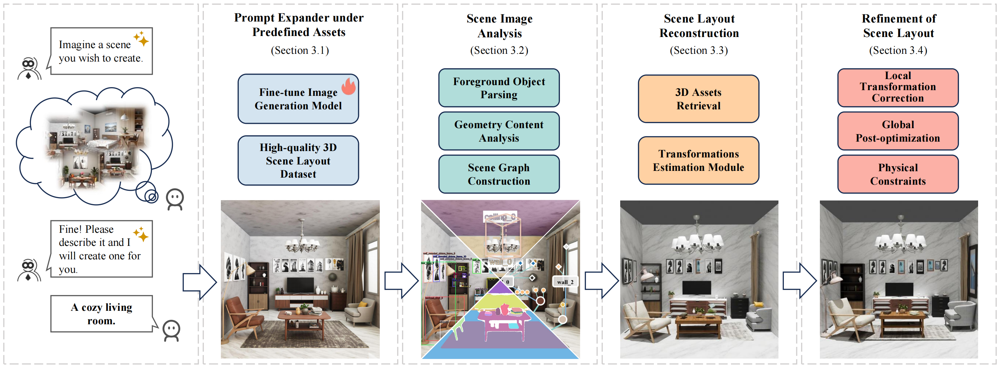

<div align="center">

# Imaginarium: 视觉引导的高质量 3D 场景布局生成

[**Xiaoming Zhu***](mailto:zxiaomingthu@163.com) ${}^1$ · [**Xu Huang***](mailto:ydove1031@gmail.com) ${}^2$ · [**Qinghongbing Xie**](mailto:xqhb23@mails.tsinghua.edu.cn) ${}^1$ · [**Zhi Deng**](mailto:zhideng@mail.ustc.edu.cn) ${}^{2\dagger}$ <br> [**Junsheng Yu**](mailto:junshengyu33@163.com) ${}^3$ · [**Yirui Guan**](mailto:guan1r@outlook.com) ${}^2$ · [**Zhongyuan Liu**](mailto:lockliu@tencent.com) ${}^2$ · [**Lin Zhu**](mailto:hahmu6918@shu.edu.cn) ${}^2$ <br> [**Qijun Zhao**](mailto:qijunzhao@tencent.com) ${}^2$ · [**Ligang Liu**](mailto:lgliu@ustc.edu.cn) ${}^4$ · [**Long Zeng**](mailto:zenglong@sz.tsinghua.edu.cn) ${}^{1\dagger}$

${}^1$ 清华大学 &nbsp; ${}^2$ 腾讯 &nbsp; ${}^3$ 东南大学 &nbsp; ${}^4$ 中国科学技术大学

*共同第一作者 &nbsp; ${}^\dagger$ 通讯作者

**SIGGRAPH ASIA 2025 & ACM Transactions on Graphics (TOG)**

<a href="https://arxiv.org/pdf/2510.15564"></a>
<a href="https://ydove0324.github.io/Imaginarium/"></a>
<a href="https://huggingface.co/datasets/HiHiAllen/Imaginarium-Dataset"></a>
<a href="./README.md"></a>

</div>

---

## 📖 简介

**Imaginarium** 是一个新颖的视觉引导 3D 布局生成系统，旨在解决生成逻辑连贯且视觉美观的定制化场景布局的挑战。我们采用图像生成模型将提示词（prompt）扩展为图像，并对其进行微调以与我们的高质量资产库对齐。随后，我们开发了一个强大的图像解析模块，基于视觉语义和几何信息恢复场景的 3D 布局，并利用场景图优化场景布局以确保逻辑连贯性。



## 🚀 更新与优化

相比原始论文，我们最近对代码库进行了优化和调整：

- **背景纹理支持**：引入了背景纹理数据库，包含检索逻辑，支持为天花板、地板和墙壁分配纹理。
- **场景图 "Groups"**：引入了 "Groups"（组）的概念。具有重复视觉特征和相似语义的物体现在共享相同的资产检索结果，以确保一致性（例如，将所有餐椅匹配到同一个资产）。
- **增强的 3D 资产检索**：实现了双机制检索系统，同时使用局部和全局图像特征匹配，并结合 VLM 进行物体尺寸优化。这提高了在遮挡和复杂场景下的鲁棒性。
- **版权清理**：我们清理并重制了具有潜在版权风险的 3D 资产，并相应更新了 3D 场景布局数据集。
- **🔄 代码与数据集更新**：由于 3D 场景和资产有部分变动，代码库在最近调优后会更新。请关注最新版本。

---

## 🛠️ 安装

### 1. 克隆仓库
```bash
git clone https://github.com/HiHiAllen/Imaginarium.git
cd Imaginarium
```

### 2. 创建 Conda 环境
```bash
conda create -n imaginarium python=3.10
conda activate imaginarium
```

### 3. 安装依赖
```bash
pip install -r requirements.txt
```

### 4. 配置 Blender 环境
本项目使用 Blender 4.3.2 进行渲染和处理，但也普遍支持 4.0+ 版本。
> **注意：** 我们在 HuggingFace 上提供了一个预配置好的 Blender 包：[🤗 blender-4.3.2-linux-x64.tar.gz](https://huggingface.co/datasets/binicey/Imaginarium-3D-Derived-Dataset)。
> **重要提示：** 即使使用了预配置包，您**仍需运行**下方的安装脚本，以确保系统路径被正确配置。
- **设置**：解压 Blender 到 `./third_party/blender-4.3.2-linux-x64` 并安装依赖：
```bash
# 确保 blender 已解压到正确路径
bash blender_install.sh
```

---

## 📦 数据准备

3D场景与资产数据集托管在 [🤗 HiHiAllen/Imaginarium-Dataset](https://huggingface.co/datasets/HiHiAllen/Imaginarium-Dataset)，衍生数据集托管在[🤗 binicey/Imaginarium-3D-Derived-Dataset](https://huggingface.co/datasets/binicey/Imaginarium-3D-Derived-Dataset) .

### 1. 3D场景与资产数据集下载

根据您的需求选择合适的方案：

#### 方案 A：完整 3D 场景布局数据集（研究用）
如需完整访问 Blend 源文件、RGB 渲染图、实例分割、边界框、深度图和元信息（描述、场景图、物体位姿），请下载：
- `imaginarium_3d_scene_layout_dataset_part1.tar.gz`
- `imaginarium_3d_scene_layout_dataset_part2.tar.gz`
- `imaginarium_3d_scene_layout_dataset_part3.tar.gz`
- `imaginarium_3d_scene_layout_dataset_part4.tar.gz`

**目录结构（以 bedroom_01 为例）：**
```text
bedroom_01/
  ├── bedroom_01_bbox_overlay.png
  ├── bedroom_01_depth_vis.png
  ├── bedroom_01_depth.npy
  ├── bedroom_01_detect_items.pkl
  ├── bedroom_01_meta.json
  ├── bedroom_01_segmentation.png
  ├── bedroom_01.blend
  └── bedroom_01.png
```

#### 方案 B：仅 Flux 微调数据
如果您只需要用于微调 Flux 的数据（RGB 图像和元信息），请下载：
-  `flux_train_data.tar.gz`

#### 方案 C：运行 Imaginarium（推理）
要使用我们提供的权重运行算法，您需要 3D 资产库和元数据：
- `imaginarium_assets.tar.gz`（3D 模型）
- `imaginarium_assets_internal_placement_space.tar.gz`（内部放置空间信息）
- `imaginarium_asset_info.csv`（元数据）
- `background_texture_dataset.tar.gz`（背景贴图数据集）
- *(可选)* `imaginarium_asset_info_with_render_images.xlsx`（视觉参考）

### 2. 衍生数据准备

算法需要衍生数据：位姿渲染图、DINOv2 嵌入、AENet 嵌入和体素（voxels）。
**我们强烈建议下载我们预处理好的数据**以节省大量时间。

**步骤 0：下载并整理文件（关键）**
在运行任何脚本之前，请从 [🤗 binicey/Imaginarium-3D-Derived-Dataset](https://huggingface.co/datasets/binicey/Imaginarium-3D-Derived-Dataset) **下载** 可用的衍生数据并将其 **解压** 到 `asset_data/` 目录中。

1.  **下载列表**：
    *   **渲染结果** (**推荐**)：`imaginarium_assets_render_results_part[1-4].tar.gz`
    *   **DINOv2 嵌入** (可选)：`imaginarium_assets_patch_embedding.tar.gz`
    *   **体素 (Voxels)** (可选)：`imaginarium_assets_voxels.tar.gz`

2.  **解压与整理**：
    在继续之前，请确保您的 `asset_data/` 文件夹结构如下：
    ```text
    asset_data/
    ├── imaginarium_assets/                  # 来自第 1 节（方案 C）
    ├── background_texture_dataset/                  # 来自第 1 节（方案 C）
    ├── imaginarium_assets_internal_placement_space/ # 来自第 1 节（方案 C）
    ├── imaginarium_assets_render_results/   # 从步骤 0 解压
    ├── imaginarium_assets_patch_embedding/  # 从步骤 0 解压（可选）
    ├── imaginarium_assets_voxels/           # 从步骤 0 解压（可选）
    └── imaginarium_asset_info.csv           # 来自第 1 节（方案 C）
    ```

---

**数据生成脚本**
如果您已下载并解压上述文件，可以跳过相应的步骤。

**步骤 1：渲染多视角图像（用于位姿估计）**
> ⚠️ **如果已下载则跳过**：此步骤需要 1-2 天。如果您已解压 `imaginarium_assets_render_results`，请跳过此步骤。
```bash
python scripts/render_fbx_parallel.py \
    --input_dir asset_data/imaginarium_assets \
    --output_dir asset_data/imaginarium_assets_render_results \
    --num_gpus 8
```

**步骤 2：提取 DINOv2 Patch 嵌入（用于检索）**
> ⚠️ **如果已下载则跳过**：如果您已解压 `imaginarium_assets_patch_embedding`，请跳过此步骤。
> *先决条件：需要 `imaginarium_assets_render_results`。*
> 时间：几分钟
```bash
python scripts/save_asset_patch_embedding_dinov2.py \
    --input_dir asset_data/imaginarium_assets_render_results \
    --output_dir asset_data/imaginarium_assets_patch_embedding
```

**步骤 3：提取 AENet 嵌入（用于位姿匹配）**
> ⚠️ **必须执行（请勿跳过）**：为了节省带宽，我们 **不提供** 此数据下载。请在本地生成。
> *先决条件：需要 `imaginarium_assets_render_results`。*
> 时间：2 小时
```bash
python scripts/extract_template_embedding.py \
    --input_dir asset_data/imaginarium_assets_render_results \
    --ae_net_weights_path weights/ae_net_pretrained_weights.pth \
    --ori_dino_weights_path weights/dinov2_vitl14.pth
```

**步骤 4：预计算体素（用于布局优化）**
> ⚠️ **如果已下载则跳过**：如果您已解压 `imaginarium_assets_voxels`，请跳过此步骤。
> *先决条件：需要 `imaginarium_assets`。*
> 时间：几分钟
```bash
python scripts/precompute_voxels.py \
    --fbx_dir asset_data/imaginarium_assets \
    --output_dir asset_data/imaginarium_assets_voxels
```

**步骤 5：将 FBX 转换为 Blend 格式（可选，加速加载）**
> ⚠️ **可选**：将 `.fbx` 资产转换为 Blender 原生 `.blend` 格式，可显著提高阶段 2 的加载速度。
> *先决条件：需要 `imaginarium_assets`。*
> 时间：约 20 分钟（取决于磁盘速度）
```bash
blender --background --python scripts/convert_fbx_to_blend.py -- --fbx_dir asset_data/imaginarium_assets --parallel --workers 8
```

### 3. 模型 Checkpoints
请下载以下权重文件并将其放置在 `weights/` 目录下：

从 [🤗 HiHiAllen/Imaginarium-Dataset](https://huggingface.co/datasets/HiHiAllen/Imaginarium-Dataset) 下载：
- `imaginarium_finetuned_flux.pth`

从 [🤗 binicey/Imaginarium-3D-Derived-Dataset](https://huggingface.co/datasets/binicey/Imaginarium-3D-Derived-Dataset) 下载：
> *注：为方便起见，我们托管了这些第三方权重（DINOv2、AENet、Depth Anything V2）。您也可以从它们的官方仓库获取。*
- `dinov2_vitl14.pth`
- `ae_net_pretrained_weights.pth`
- `depth_anything_v2_metric_hypersim_vitl.pth`

### 4. 最终文件结构
完成所有步骤后，您的项目目录应如下所示：

```text
Imaginarium/
├── asset_data/
│   ├── imaginarium_assets/                    # 3D 资产（FBX 文件）
│   ├── imaginarium_assets_render_results/     # 渲染图像和位姿
│   ├── imaginarium_assets_patch_embedding/    # 在步骤 2 中生成
│   ├── imaginarium_assets_internal_placement_space   
│   ├── imaginarium_assets_voxels              # 在步骤 4 中生成
│   └── imaginarium_asset_info.csv             
├── weights/
│   ├── imaginarium_finetuned_flux.pth
│   ├── dinov2_vitl14.pth
│   ├── ae_net_pretrained_weights.pth
│   └── depth_anything_v2_metric_hypersim_vitl.pth
├── third_party/
│   └── blender-4.3.2-linux-x64
└── ...
```

---

## ⚙️ 配置

1. **创建配置文件**：
   ```bash
   cp config/config-example.yaml config/config.yaml
   ```

2. **设置 API 密钥**：编辑 `config/config.yaml`。
   *   **LLM 配置**：输入您的 API 密钥和端点。
       *   *注：我们在最近的测试和调试中使用了 `claude-4-5-sonnet`。*
   *   **Grounding DINO**：从 [DeepDataSpace](https://deepdataspace.com/request_api) 或 [Grounding-DINO API](https://github.com/IDEA-Research/Grounding-DINO-1.5-API) 仓库获取您的 API 令牌。

---

## 🚀 使用方法

该流程包含两个阶段：

### 阶段 1：文本到图像 (T2I)
使用微调后的 Flux 模型生成场景图像。
> **备注：** 推荐使用 **A100** 显卡运行。
```bash
python run_imaginarium_T2I.py --prompt 'A cozy living room featuring comfortable armchairs, a gallery wall, and a stylish coffee table.' --num 4 --output_dir cozy_living_room
```

### 阶段 2：图像到 3D 布局 (I2Layout)
从生成的图像中恢复 3D 布局。
> **备注：** 可在 **RTX 3090** 及以上显卡完整运行。
> **Note:** 首次运行比较慢，请耐心等待.
```bash
# 基本运行
python run_imaginarium_I2Layout.py demo/demo_0.png

# 运行前清理以前的结果
python run_imaginarium_I2Layout.py demo/demo_0.png --clean

# 调试模式（可视化并打印详细的中间结果）
python run_imaginarium_I2Layout.py demo/demo_0.png --clean --debug
```

---

下面给出“微调 FLUX”这一节的优化版本，中英文对照，并配上相应 Emoji，使其风格与原文档保持一致。  

---

## 🎨 微调 FLUX
如果您希望在自己的数据集上微调 Flux，我们提供了训练脚本。

1. **准备数据**：将您的数据整理为 HuggingFace Datasets 兼容的格式（例如图像文件夹或 JSONL）。
2. **运行训练**：

```bash
accelerate launch scripts/train_imaginarium_flux.py \
  --pretrained_model_name_or_path "black-forest-labs/FLUX.1-dev" \
  --dataset_name "your_dataset_name" \
  --output_dir "flux-finetuned" \
  --mixed_precision "bf16" \
  --num_train_epochs 15 \
  --rank 16 \
  --learning_rate 1e-4 \
  --resolution 1024
```

---

## 🆕 添加新资产

要向库中添加新的 FBX 模型：
1. 更新 `asset_data/imaginarium_asset_info.csv` 中的新资产元数据。
2. 运行 **衍生数据准备** 脚本（步骤 1-5）以生成必要的渲染图像、嵌入和体素。

---

## 📜 许可

- **3D 场景数据集**：**CC BY-NC-SA 4.0**。
    版权所有 © Imaginarium 团队。
- **3D 资产数据集**：**CC BY-NC-SA 4.0**。
    该数据集结合了三个来源的资产：**我们内部团队**、**开源社区** 和 **UE Fab**（经明确授权使用）。完整的致谢和来源在元数据中有详细说明。

---

## 🔗 引用

如果您觉得我们的工作对您的研究有帮助，请考虑引用：

```bibtex
@article{zhu2025imaginarium,
  title={Imaginarium: Vision-guided High-Quality 3D Scene Layout Generation},
  author={Zhu, Xiaoming and Huang, Xu and Xie, Qinghongbing and Deng, Zhi and Yu, Junsheng and Guan, Yirui and Liu, Zhongyuan and Zhu, Lin and Zhao, Qijun and Liu, Ligang and others},
  journal={arXiv preprint arXiv:2510.15564},
  year={2025}
}
```

---

## 🙏 致谢

我们感谢 [GigaPose](https://github.com/nv-nguyen/gigapose)、[Depth Anything V2](https://github.com/DepthAnything/Depth-Anything-V2) 和 [Grounding DINO 1.5](https://github.com/IDEA-Research/Grounding-DINO-1.5-API) 的作者。

**特别感谢 3D 艺术家**
我们要向来自开源社区和 UE Fab 的相关 3D 艺术家致以最深切的感谢。你们的创意贡献是本项目的基础。

**最后，衷心感谢每一位为 Imaginarium 做出贡献的人！**

